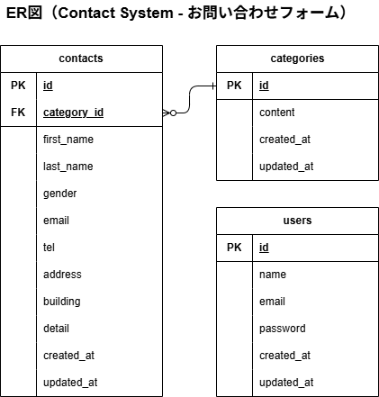

# Contact System - お問い合わせフォーム
***
## 環境構築
1. リポジトリを取得
	```bash
	# ホスト側
	git clone リンク
	```

2. Dockerビルド＆起動
	```bash
	# ホスト側
	docker-compose up -d --build
	```

3. 環境変数ファイルコピー（ホスト側）
	```bash
	# ホスト側
	cp .env.example .env
	```
	> ※ 今回の環境では、UID/GID の指定が .env.example に含まれています。権限エラーが発生する場合は、ホスト環境に合わせて修正してください。
	また、MySQLはOSによって起動しない場合があるのでそれぞれのPCに合わせて docker-compose.ymlファイルを編集してください。
****
## Laravel環境構築

1. PHPコンテナに入る
    ```bash
	# ホスト側
    docker compose exec php bash
    ```

2. Composer インストール
    ```bash
	# PHPコンテナ内
    cd /var/www
	composer install
    ```

3. 環境変数ファイルコピー（Laravel用）
	```bash
	# PHPコンテナ内(/var/www)
	cp .env.example .env
	```
	>※ DB接続設定を docker-compose.yml に合わせて修正
4. アプリキー作成
	```bash
	# PHPコンテナ内
	php artisan key:generate
	```

5. マイグレーション
	```bash
	# PHPコンテナ内
	php artisan migrate
	```

6. シーディング
	```bash
	# PHPコンテナ内
	php artisan db:seed
	```
***
## 使用技術

- PHP 8.1.33
- Laravel 8.83.29
- MySQL 8.0.26
- Nginx 1.21.1
- Docker 28.3.0 / docker compose 2.38.1-desktop.1
***
## ER図

***
## URL
- 開発環境：http://localhost/
- phpMyAdmin：http://localhost:8080/
